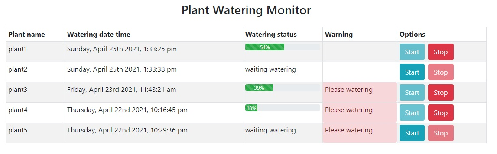

# a .NET Core (Web API) solution with a React front-end, React native, react hooks, redux. 
- start and stop watering of a plant. A plant takes 10 seconds to water.
- support watering multiple plants at the same time
- not be able to water the plant again within 30 seconds of the last watering session.
- be visually alerted if a plant hasn’t been watered for more than 6 hours.
# First, you need to run server(net core API).
## server main screen

then you can lunch the website
## website main screen

## Watering screen

